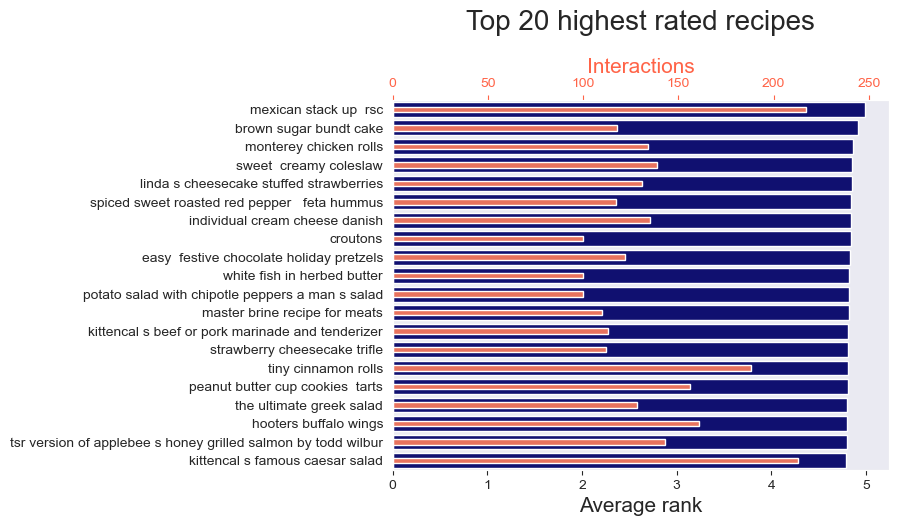
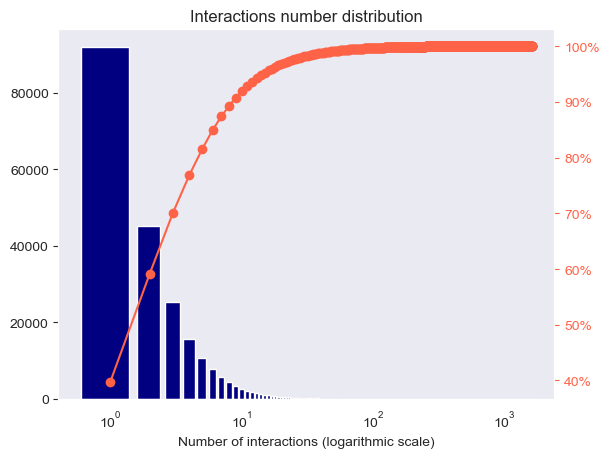

# Foodie - recipes recommendations

## Project goal and overview

Ok, so hello DS community! That's my very first data science project I wanted to share with you. This is a food recipe recommendation tool - based on item similarity machine learning tool - cosine similarity. The user passes an existing recipe to the ML model and gets list of most similar recipes that he should like.  
The model uses data shared as a dataset by Food.com (formerly GeniusKitchen). The data used in the model consists of:
 - Raw data of the recipes - that's where the original recipe is stored - in text format,
 - List of interactions between users and particular recipes - review and rate given by a user to a particular recipe.

There are also other data imported, which may be used in other cases.
After the data was imported it was analysed to let us know what we are dealing with. To make it easier I've gathered data from imported files in one dataset. I used it then to create rankings of the most popular recipes, recipes with highest ratings, or distribution of interactions number among the recipes. 
 

 
 

 
 
After that the data was implemented in the ML model using sparse matrix. 

## But why...?

## How to run the project

## Possible upgrades

other approach, api, implementation in app or whtvr

## Credits
